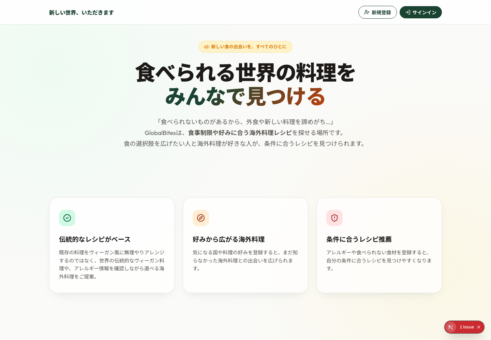
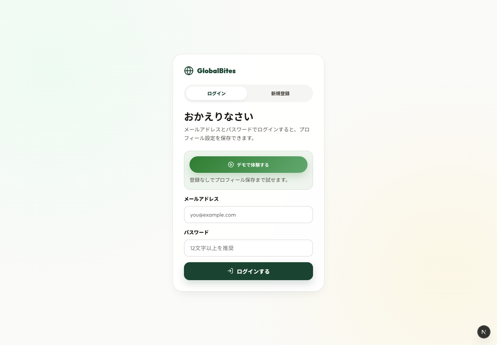

# Team 04 — Engineer Guild Hackathon 2026/05

> **1行ピッチ**：世界をいただきます

## スクリーンショット

| メイン画面（ランディング） | 主要機能（ログイン / デモ導線） |
|---|---|
|  |  |

## チーム情報

| 項目 | 内容 |
|---|---|
| チーム名 | Team 04 |
| プロダクト名 | Edible（UI 表示の一部に開発時名称 `GlobalBites` が残存） |
| 担当メンター | じゅんのすけさん |

### メンバー

| GitHub | 氏名 | 大学 / 学部 | 担当役割 |
|---|---|---|---|
| @sebastian-oshiro | 大城セバスティアン | 芝浦工業大学 システム理工学部 | PdM / BE |
| @Kazuki-Onishi | 大西一輝 | 京都大学 工学研究科 | BE |
| @snowykr | KOO JUN | 東海大学 情報通信学部 | Full Stack |
| @c-hikita | 疋田 智佳子 | 同志社大学 理工学研究科 | FE / Design |

担当役割の凡例：**PM** / **BE**（Backend）/ **FE**（Frontend）/ **Full Stack** / **Design** / **Infra** / **Data** / その他

## プロダクト概要

**Edible** は、食の制約から食べられるものへの偏愛という「マイナスから生まれた偏愛」を、未知の食文化への「プラスの偏愛」に変えるレシピプラットフォームです。

## コンセプト：マイナスの偏愛から、プラスの偏愛へ

アレルギー、グルテンフリー、ヴィーガン、ハラール——食の制約を持つ人は、「食べられないもの」を避けるために、原材料を一つひとつ読み解き、安全な食材を探し続けています。それは消極的な行為に見えて、実は **「食べられるものを探すこと」への、誰よりも強い偏愛** でもあります。

Edible は、この「マイナス起点の偏愛」を、世界の未知の料理と交差させるサービスです。

小麦アレルギーで麺類を諦めていた人が、米粉でできたベトナムの「フォー」と出会う。「他にグルテンフリーの麺料理はある？」「他のベトナム料理は？」「ベトナムってどんな国？」——避けるための偏愛が、知るための偏愛へと反転し、好奇心の連鎖が始まる。**制約があったからこそ生まれる、思いがけない熱狂** がここにあります。

## MVP の体験

プロフィールに食の制約と嗜好を登録すると、AI が **世界中の料理から、その人が食べられるものを横断的に提案** します。気になる料理をタップすればレシピが表示され、本場の食材は **日本で手に入る食材へ自動翻訳**。さらに料理の背景にあるコラム（食文化・関連料理・産地情報）にもその場でアクセスでき、好奇心の連鎖をそのまま追いかけられます。

## 解決したい課題

食事制限を持つ人は、外食で原材料が不透明なため自炊が中心になりがちで、レパートリーが固定化しやすい。馴染みのない海外料理が安全に食べられるかを調べるには原材料を一つずつトレースする必要があり、時間も労力もかかる。制限の種類や強さは人それぞれで、身近に同じ条件の仲間も見つけにくく、工夫や知見を共有できる場も少ない。

「食べられないもの」に向けてきた偏愛が、「食べられるもの」を広げる力に変わらないまま、閉じてしまっている。

## ターゲットユーザー

アレルギー、グルテンフリー、ヴィーガン、ハラールなど、食に制約を抱えながら自分の食べられる物の探求をしている偏愛家。「自分が食べられる料理の世界をもっと広げたい」と感じている人。

## 将来構想

MVP は「マイナスの偏愛がプラスの偏愛と出会う」場。中期では同じ制約を持つ人同士が独自のノウハウやマイナーな店舗情報を持ち寄る **相互扶助コミュニティ** へと拡張し、長期では旅行プラン提案や偏愛ミールキットの共同開発など、**偏愛と偏愛が交差して新しい文化が生まれる場** を目指します。

### コア機能（MVP 実装済み）
- **プロフィール条件に基づくレシピ探索**：アレルギー食材・食のスタンス（ヴィーガン/ベジタリアン等）・好みの文化を登録すると、条件に合うレシピをおすすめ順で探せる。
- **安全側のレシピフィルタリング**：食材アレルゲン、食事制限、調理状態（生魚・半生など）を API / UI の両方で照合し、食べられない条件に触れる候補を除外。
- **気分入力による AI レシピ提案**：保存済みレシピの中から、OpenRouter 経由の AI が「今日の気分」に合う候補を読み取り専用で選定。
- **日本で手に入りやすい食材への代替提案**：レシピ詳細から、登録済み制限を避けた代替食材案を AI が提示（DB への自動保存はしない）。
- **キュレーション済みレシピデータベース**：世界各地の伝統料理を、材料・手順・文化背景・関連料理情報付きで収録（東南アジア、インド、ペルー、欧州、アフリカほか）。
- **Supabase 認証 + RLS + DB-backed デモログイン**：メール／パスワード認証、ユーザーごとのプロフィール・好みデータ、ゲスト体験用プロフィールをセキュアに管理。

## 提出ステータス（運営チェック用 — 各 Day 終了時に記入）

- [x] **Day1 終了時**：テーマ確定（プロダクト名・解決課題・ターゲットを記入済み）
- [x] **Day2 終了時**：MVP 動作（デプロイ済み URL を下記「デモ環境」欄に記載済み）
- [ ] **Day3 終了時**：提出完了（プレゼン資料 URL / デモ動画 URL / AI 活用ログ完成）※ README 整備時点ではプレゼン資料 / デモ動画 URL 未確定

## 提出物チェックリスト（Day3 17:00 提出〆切）

- [x] 動くデモ（Vercel 公開 URL を「デモ環境」欄に記載）
- [x] ソースコード（このリポに push 済み）
- [x] [`AI_USAGE_LOG.md`](./AI_USAGE_LOG.md)（AI 活用ログ、開発期間中の追記必須）
- [ ] プレゼン資料（公開 URL 未確定）
- [ ] デモ動画（任意提出。README 整備時点では未作成）

## デモ・関連リンク

| 種別 | URL |
|---|---|
| デモ環境 | <https://team-04-delta.vercel.app>（Production: <https://team-04-deggpa0su-snowys-projects-2fb93f6e.vercel.app>） |
| プレゼン資料 | 未公開（提出時に PDF / Slides URL を追加） |
| デモ動画 | 未作成（任意提出。必要に応じて YouTube / Loom URL を追加） |

## 技術スタック

- **フロントエンド**：Next.js 15.5 / React 19 / TypeScript / lucide-react（バニラ CSS、Tailwind 不使用）
- **バックエンド**：Supabase（PostgreSQL + Auth + Row Level Security）、Next.js API Routes
- **インフラ**：Vercel（自動デプロイ）／ GitHub Actions（マイグレーション CI）
- **利用 AI ツール**：Claude / Claude Code（要件定義・実装・モック・ログ整備）／ ChatGPT（市場調査・プレゼン批評）／ antigravity (Gemini 3 Pro)（フロントエンド設計）／ Google Meet 自動議事録

### 使用した外部 API / サービス

| サービス名 | 用途 | プラン | 備考 |
|---|---|---|---|
| Supabase | DB / 認証 / RLS | Free | プロジェクト ref: `kiicjqiylsmlxupvhrti` |
| Vercel | フロントエンドホスティング・自動デプロイ | Free | GitHub 連携 |
| OpenRouter | レシピ候補選定・代替食材提案の AI Gateway | Free / 個人枠 | サーバー専用キーで利用 |
| Claude / ChatGPT / antigravity | 要件定義・コード生成・批評 | 個人プラン | 詳細は [`AI_USAGE_LOG.md`](./AI_USAGE_LOG.md) |

→ API キー・秘匿情報は `.env`（`.gitignore` 対象）で管理。公開リポ化に備えて漏らさないこと。

## ディレクトリ構成（主要）

```
team-04/
├── src/app/                 # Next.js App Router
│   ├── api/                 # API Routes（ingredients, me, recipes）
│   ├── auth/, login/        # 認証フロー
│   ├── components/          # LandingView / ListView / RecipeModal / ProfileView / Navbar
│   └── page.tsx             # メインコントローラ
├── src/lib/                 # ドメインロジック（dietaryRestrictions, recipeMapping, supabase 等）
├── supabase/
│   ├── migrations/          # スキーマ・RLS・seed 用マイグレーション
│   └── seed-data/           # キュレーション済みレシピ JSON
├── scripts/regression/      # 回帰テスト
├── docs/                    # auth.md / database.md / frontend.md
├── AI_USAGE_LOG.md          # AI 活用ログ（審査根拠資料）
└── README.md
```

## セットアップ手順

フロントエンドは Next.js 15 系に固定しています。Supabase は Web 上のクラウドプロジェクトを Supabase CLI でリンクして利用します。

```bash
# 1. クローン
git clone https://github.com/engineer-guild-hackathon-2026-05/team-04.git
cd team-04

# 2. 依存関係をインストール
npm install

# 3. Supabase Web プロジェクトに接続
supabase login
supabase link --project-ref kiicjqiylsmlxupvhrti

# 4. 開発サーバーを起動
npm run dev
```

環境変数は `.env.local` に保存し、リポジトリへコミットしないでください。

```bash
NEXT_PUBLIC_SUPABASE_URL=https://<project-ref>.supabase.co
NEXT_PUBLIC_SUPABASE_PUBLISHABLE_KEY=<publishable-key>
OPENROUTER_API_KEY=<openrouter-api-key>          # AI提案を使う場合のみ / サーバー専用
OPENROUTER_MODEL=google/gemini-3.1-flash-lite   # 任意
SUPABASE_SERVICE_ROLE_KEY=<service-role-key>     # DB-backed demo login を使う場合のみ / サーバー専用
DEMO_SESSION_SECRET=<long-random-secret>         # DB-backed demo login のCookie署名用
```

品質確認には以下を使用します。

```bash
npm run lint
npm run typecheck
npm run build
npm run test       # scripts/regression/ の回帰テスト
```

## 既知の問題 / 未実装機能（Day3 審査員向け）

開発期間が短いため、Day3 提出時点では以下を明示する。

- 制限あり：AI レシピ提案・代替食材提案は **既存DBの候補から選ぶ読み取り専用機能**。AI が新規レシピをDBへ保存したり、pgvector で意味検索したりする段階までは未実装。
- 制限あり：気分入力はテキスト欄で実装済みだが、当初案のスライダー UI（さっぱり / がっつり等の連続値）は未実装。
- 未実装：コミュニティ機能（プロフィール公開・仲間マッチング・多言語 AI 翻訳付きコメント）。将来構想として README に記載。
- 未確定：プレゼン資料 URL、デモ動画 URL は README 整備時点では未反映。デモ URL は GitHub/Vercel の Production deployment を記載済み。

## 担当メンター・壁打ち履歴

| 日時 | メンター | 議論内容（要点） | 採用 / 一部採用 / 不採用 |
|---|---|---|---|
| Day2 第1回 FB | じゅんのすけさん | 「食べられないもの」を避けるだけでなく、未知の食文化へ好奇心を広げる体験価値を前面に出す。MVP はプロフィール登録と安全なレシピ探索に絞る。 | 採用 |
| Day2 第2回 FB | じゅんのすけさん | コミュニティ、旅行、ミールキットなどの拡張案は将来構想へ回し、Day3 は動くデモ・AI活用ログ・発表ストーリーの完成度を優先する。 | 一部採用 |

## AI 活用ログ

審査項目「AI 活用度」の根拠資料 → [`AI_USAGE_LOG.md`](./AI_USAGE_LOG.md)

ブレスト・コンセプト再定義・ペルソナ整理・コピーライティング・市場調査・モック作成・プレゼン批評・議事録要約まで、開発全工程での AI 活用を**プロンプト原文付き**で記録。採用 / 一部採用 / 不採用の判断と理由も併記している。

## 公開許諾（チーム全員合意のうえ記入 — Day3 終了時までに）

提出後の運営側での扱いに関するチーム全員合意です。**いずれも N で構いません（審査に一切影響なし）**。

| 項目 | 許諾 (Y/N) | 補足・条件 |
|---|---|---|
| ① このリポを **Public 化**してよい（コードがすべて公開される） | Y | 秘密情報は `.env.local` などで管理し、リポジトリには含めない |
| ② プロダクト名・スクリーンショット・1行ピッチを **HTV / Mercari の SNS・記事**で掲載してよい | Y | 掲載可 |
| ③ **スポンサー企業（Mercari, P&G 等）の広報・採用ページ**でプロダクト紹介してよい | Y | 掲載可 |

## 審査観点（参考）

審査は以下 8 項目で実施されます。実装中に意識すべきポイント：

1. 実用性
2. 創造性
3. UI / UX
4. 技術的挑戦
5. 将来性
6. 完成度
7. プレゼンテーション
8. AI 活用度（→ [`AI_USAGE_LOG.md`](./AI_USAGE_LOG.md) が根拠資料）

## 謝辞（任意）

Engineer Guild Hackathon 2026/05 の運営・スポンサー・メンターのみなさま、短期間でユーザー課題の深掘りから実装、発表準備まで伴走いただきありがとうございました。食の制約を「諦め」ではなく「探索のきっかけ」に変えるというテーマを、チームで最後まで磨くことができました。

## 運営連絡先

- Slack: `#eg-hackathon-2026-05`（または `#pjt_swe_event`）
- 緊急時: 運営メンバー（Mercari HQ 受付 → 運営呼び出し）
