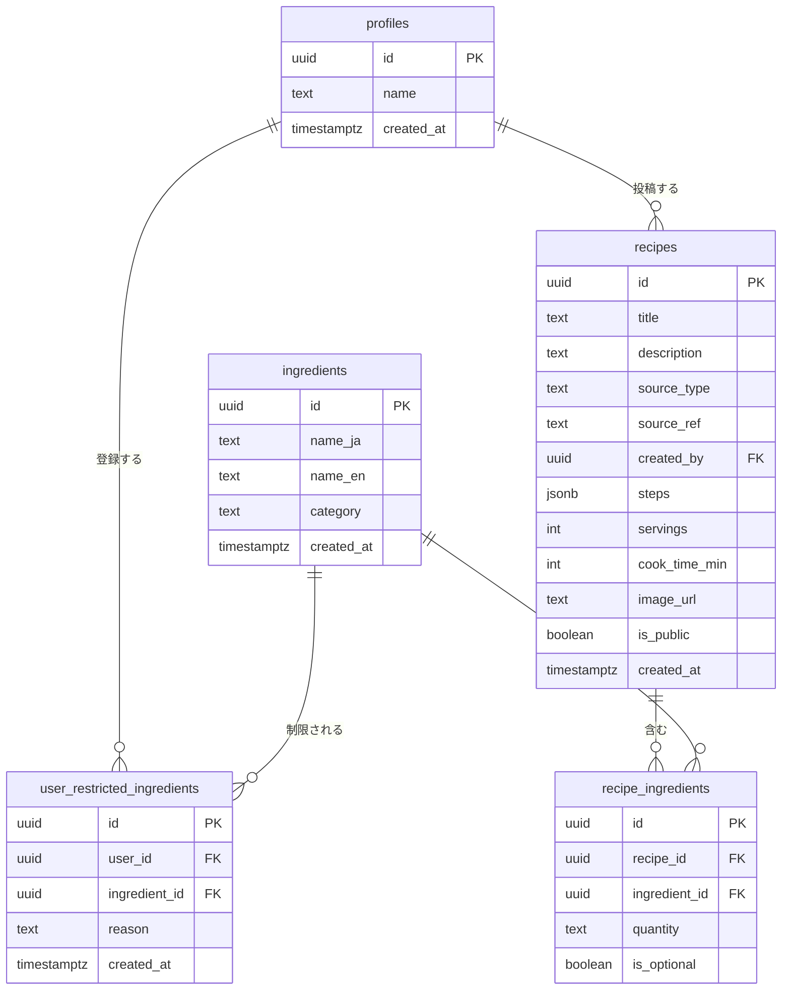

# データベース設計

## ER図



## テーブル定義

### profiles
`auth.users` の拡張テーブル。ユーザー登録時にトリガーで自動生成される。

### ingredients
材料マスタ。日本のアレルギー表示基準に基づく28品目を初期データとしてシード済み。
日本語名（`name_ja`）と英語名（`name_en`）を持ち、多言語対応のUIで出し分けられる。

### user_restricted_ingredients
ユーザーが登録したNG材料。`reason` で除外理由（アレルギー / 好み / 宗教上）を区別できる。
`(user_id, ingredient_id)` にユニーク制約があり、同じ材料の重複登録を防ぐ。

### recipes
AI生成・外部API取得・ユーザー投稿のレシピをすべて格納する。
`source_type` で出所を区別することで、将来のユーザー投稿機能追加時もテーブル変更が不要。

| source_type | 説明 | created_by |
|---|---|---|
| `ai` | Claude APIが生成 | null |
| `api` | 外部レシピAPI取得（将来） | null |
| `user` | ユーザー投稿（将来） | ユーザーのID |

### recipe_ingredients
レシピと材料の中間テーブル。材料をJSONに埋め込まず正規化することで、NG材料の除外をSQLで完結させられる。

```sql
-- NG材料を含まないレシピを取得するクエリ例
SELECT r.*
FROM recipes r
WHERE r.id NOT IN (
  SELECT recipe_id FROM recipe_ingredients
  WHERE ingredient_id IN (
    SELECT ingredient_id FROM user_restricted_ingredients
    WHERE user_id = '<ユーザーID>'
  )
);
```

## 書き込み権限とservice roleの運用

### ロール別の書き込み可否

| source_type | 書き込み主体 | 使用するロール | 経路 |
|---|---|---|---|
| `ai` | サーバーサイド | service role | Next.js API Route |
| `api` | サーバーサイド | service role | Next.js API Route（将来） |
| `user` | クライアント | authenticated | Supabase JS Client |

### なぜai/apiにRLS policyを設けないか

`source_type = 'ai'` および `'api'` のレシピはサーバーサイド（Next.js API Route）からservice roleキーを使って書き込む。service roleはRLSをバイパスするため、クライアントからの不正書き込みを防ぎつつサーバーからの書き込みを可能にする。

### 必要な環境変数

```
# .env.local（リポジトリにコミットしない）
SUPABASE_URL=https://<project>.supabase.co
SUPABASE_ANON_KEY=<anon key>          # クライアント用
SUPABASE_SERVICE_ROLE_KEY=<service role key>  # サーバーサイド専用・絶対に公開しない
```

service role keyはSupabaseダッシュボードの `Settings > API` から取得できる。

## マイグレーションファイル

| ファイル | 内容 |
|---|---|
| `20260524000001_init_schema.sql` | テーブル定義・RLSポリシー・トリガー |
| `20260524000002_seed_ingredients.sql` | 材料マスタ28品目の初期データ |
