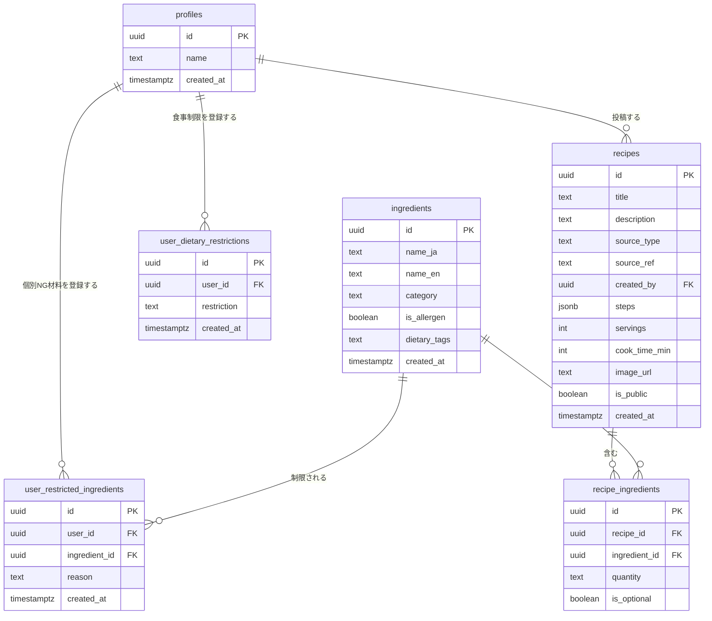

# データベース設計

## ER図



## テーブル定義

### profiles
`auth.users` の拡張テーブル。ユーザー登録時にトリガーで自動生成される。

### ingredients
原材料マスタ。日本語名（`name_ja`）と英語名（`name_en`）を持ち、多言語対応のUIで出し分けられる。

| カラム | 説明 |
|---|---|
| `is_allergen` | `true` のものだけユーザーのNG材料選択UIに表示される。初期28品目は `true` 、AIが追加する材料は `false` |
| `dietary_tags` | `vegan` / `gluten-free` 等のプリセット除外に使うタグ配列。例: `{meat, animal-product}` |

### user_restricted_ingredients
ユーザーが個別に選択したNG材料（例：「えびだけ食べられない」）。
`reason` で除外理由（`allergy` / `dislike` / `religious`）を区別できる。

### user_dietary_restrictions
ヴィーガン・グルテンフリー等の生活習慣・思想に基づく食事制限プリセット。個別材料ではなくカテゴリ単位で除外する。

| restriction | 除外対象タグ | 対象者 |
|---|---|---|
| `vegan` | `animal-product` | 動物性食品全般を避ける人 |
| `vegetarian` | `meat`, `fish`, `shellfish` | 肉・魚を避ける人 |
| `pescatarian` | `meat` | 魚介は食べるが肉を避ける人 |
| `gluten-free` | `gluten` | グルテンを避ける人 |
| `halal` | `pork`, `alcohol` | ハラール食の人 |
| `kosher` | `pork`, `shellfish` | コーシャー食の人 |

### recipes
AI生成・外部API取得・ユーザー投稿のレシピをすべて格納する。
`source_type` で出所を区別することで、将来のユーザー投稿機能追加時もテーブル変更が不要。

| source_type | 説明 | created_by |
|---|---|---|
| `ai` | Claude APIが生成 | null |
| `api` | 外部レシピAPI取得（将来） | null |
| `user` | ユーザー投稿（将来） | ユーザーのID |

### recipe_ingredients
レシピと原材料の中間テーブル。材料をJSONに埋め込まず正規化することで、NG材料の除外をSQLで完結させられる。

```sql
-- 個別NG材料 + 食事制限プリセットの両方を考慮してレシピをフィルタするクエリ例
SELECT r.*
FROM recipes r
WHERE r.id NOT IN (
  -- 個別NG材料による除外
  SELECT ri.recipe_id FROM recipe_ingredients ri
  WHERE ri.ingredient_id IN (
    SELECT ingredient_id FROM user_restricted_ingredients
    WHERE user_id = '<ユーザーID>'
  )
  UNION
  -- 食事制限プリセットによる除外
  SELECT ri.recipe_id FROM recipe_ingredients ri
  JOIN ingredients i ON i.id = ri.ingredient_id
  WHERE i.dietary_tags && (
    SELECT array_agg(tag) FROM (
      SELECT unnest(
        CASE restriction
          WHEN 'vegan'        THEN ARRAY['animal-product']
          WHEN 'vegetarian'   THEN ARRAY['meat','fish','shellfish']
          WHEN 'pescatarian'  THEN ARRAY['meat']
          WHEN 'gluten-free'  THEN ARRAY['gluten']
          WHEN 'halal'        THEN ARRAY['pork','alcohol']
          WHEN 'kosher'       THEN ARRAY['pork','shellfish']
        END
      ) AS tag
      FROM user_dietary_restrictions
      WHERE user_id = '<ユーザーID>'
    ) t
  )
);
```

## 書き込み権限とservice roleの運用

### ロール別の書き込み可否

| source_type | 書き込み主体 | 使用するロール | 経路 |
|---|---|---|---|
| `ai` | サーバーサイド | service role | Next.js API Route |
| `api` | サーバーサイド | service role | Next.js API Route（将来） |
| `user` | クライアント | authenticated | Supabase JS Client |

### なぜai/apiにRLS policyを設けないか

`source_type = 'ai'` および `'api'` のレシピはサーバーサイド（Next.js API Route）からservice roleキーを使って書き込む。service roleはRLSをバイパスするため、クライアントからの不正書き込みを防ぎつつサーバーからの書き込みを可能にする。

### 必要な環境変数

```
# .env.local（リポジトリにコミットしない）
SUPABASE_URL=https://<project>.supabase.co
SUPABASE_ANON_KEY=<anon key>          # クライアント用
SUPABASE_SERVICE_ROLE_KEY=<service role key>  # サーバーサイド専用・絶対に公開しない
```

service role keyはSupabaseダッシュボードの `Settings > API` から取得できる。

## マイグレーションファイル

| ファイル | 内容 |
|---|---|
| `20260524000001_init_schema.sql` | テーブル定義・RLSポリシー・トリガー |
| `20260524000002_seed_ingredients.sql` | 材料マスタ28品目の初期データ |
| `20260524000003_add_dietary_support.sql` | `is_allergen`・`dietary_tags` 追加、`user_dietary_restrictions` テーブル追加 |
