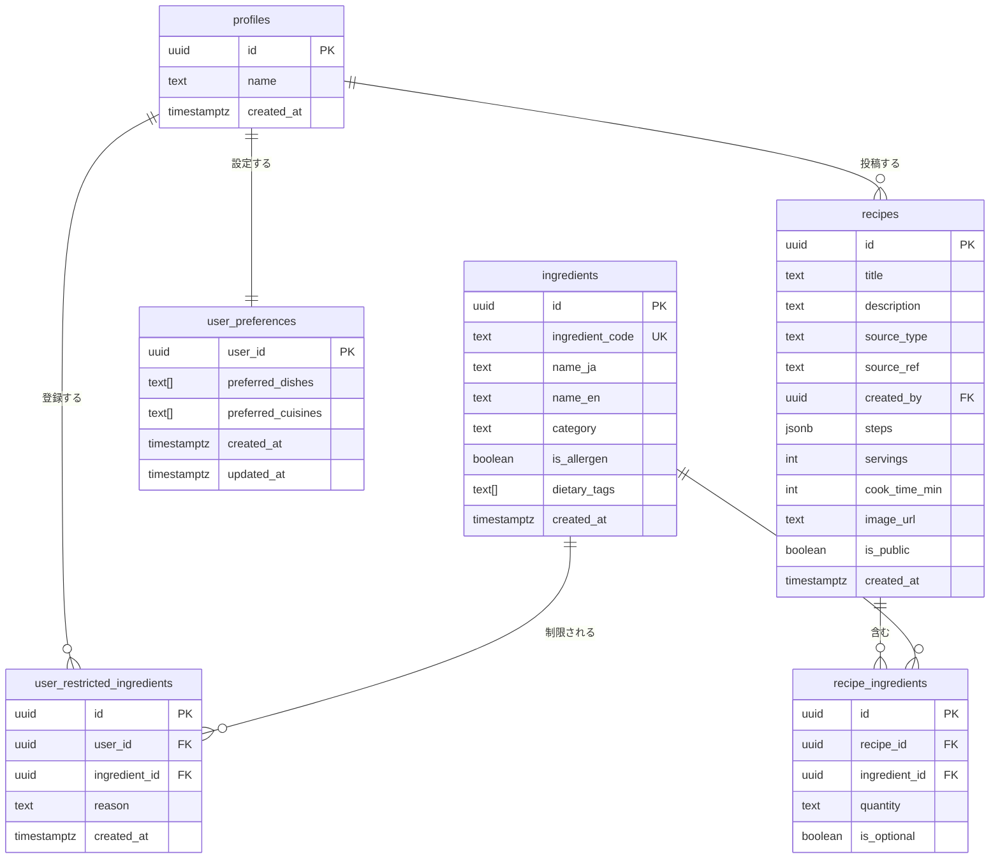

# データベース設計

## ER図



## テーブル定義

### profiles
`auth.users` の拡張テーブル。ユーザー登録時にトリガーで自動生成される。

### ingredients
材料マスタ。日本のアレルギー表示基準に基づく28品目を初期データとしてシード済み。
日本語名（`name_ja`）と英語名（`name_en`）を持ち、多言語対応のUIで出し分けられる。

| カラム | 説明 |
|---|---|
| `ingredient_code` | API・フロント・AI連携で使う安定ID。表示名変更や多言語化の影響を受けない。例: `ing-shrimp`, `ing-wheat`, `ing-egg` |
| `is_allergen` | `true` のものだけユーザーのNG材料選択UIに表示される。初期28品目は `true`、AIが追加する材料は `false` |
| `dietary_tags` | `vegan` / `gluten-free` 等のプリセット除外に使うタグ配列。例: `{meat, animal-product}` |

`ingredient_code` は既存28品目などUIで選択する材料に必ず付与し、nullable + partial unique indexで管理する。AI/APIが後から追加する非選択材料は `ingredient_code` を持たない場合がある。
UUIDの `id` はDB内部のFK用途に限定する。

### user_restricted_ingredients
ユーザーが選択したNG材料。ヴィーガン・グルテンフリー等のプリセットも含めて、最終的にユーザーが確定した個別材料のみをここに保存する。
`reason` で除外理由（`allergy` / `dislike` / `religious`）を区別できる。
`(user_id, ingredient_id)` にユニーク制約があり、同じ材料の重複登録を防ぐ。

### user_preferences
ユーザーごとの料理の好みを保存する設定テーブル。`profiles.id` と1:1で紐づく。
NG材料は既存の `user_restricted_ingredients` に保存し、API層で `ingredients.ingredient_code` に変換して返す。

| カラム | 説明 |
|---|---|
| `user_id` | `profiles.id` を参照する主キー |
| `preferred_dishes` | ユーザーが好む料理タイプの配列。例: `soup`, `salad`, `spicy` |
| `preferred_cuisines` | ユーザーが好む国・地域料理の配列。例: `india`, `mexico` |
| `created_at` | 設定作成日時 |
| `updated_at` | 設定更新日時 |

`/api/me/profile` では `profiles.name`、`user_preferences`、`user_restricted_ingredients` をまとめてプロフィール設定として返す。
保存時は、NG材料の `ingredient_code` から `ingredients.id` を解決して `user_restricted_ingredients` を同期する。

### recipes
AI生成・外部API取得・ユーザー投稿のレシピをすべて格納する。
`source_type` で出所を区別することで、将来のユーザー投稿機能追加時もテーブル変更が不要。

| source_type | 説明 | created_by |
|---|---|---|
| `ai` | Claude APIが生成 | null |
| `api` | 外部レシピAPI取得（将来） | null |
| `user` | ユーザー投稿（将来） | ユーザーのID |

### recipe_ingredients
レシピと材料の中間テーブル。材料をJSONに埋め込まず正規化することで、NG材料の除外をSQLで完結させられる。

```sql
-- NG材料を含まないレシピを取得するクエリ例
SELECT r.*
FROM recipes r
WHERE r.id NOT IN (
  SELECT recipe_id FROM recipe_ingredients
  WHERE ingredient_id IN (
    SELECT ingredient_id FROM user_restricted_ingredients
    WHERE user_id = '<ユーザーID>'
  )
);
```

## 書き込み権限とservice roleの運用

### ロール別の書き込み可否

| source_type | 書き込み主体 | 使用するロール | 経路 |
|---|---|---|---|
| `ai` | サーバーサイド | service role | Next.js API Route |
| `api` | サーバーサイド | service role | Next.js API Route（将来） |
| `user` | クライアント | authenticated | Supabase JS Client |

### なぜai/apiにRLS policyを設けないか

`source_type = 'ai'` および `'api'` のレシピはサーバーサイド（Next.js API Route）からservice roleキーを使って書き込む。service roleはRLSをバイパスするため、クライアントからの不正書き込みを防ぎつつサーバーからの書き込みを可能にする。

### 必要な環境変数

```
# .env.local（リポジトリにコミットしない）
NEXT_PUBLIC_SUPABASE_URL=https://<project>.supabase.co
NEXT_PUBLIC_SUPABASE_ANON_KEY=<anon key>      # ブラウザにも公開される。RLS前提の通常操作用
SUPABASE_SERVICE_ROLE_KEY=<service role key>  # サーバーサイド専用・NEXT_PUBLIC_禁止
```

service role keyはSupabaseダッシュボードの `Settings > API` から取得できる。
`NEXT_PUBLIC_` 付きの値はブラウザに露出するため、RLSで許可された読み書きにだけ使う。
`SUPABASE_SERVICE_ROLE_KEY` はRLSをバイパスするため、Route Handler内の信頼済み処理（例: AI/API由来レシピの保存）に限定する。
プロフィール・ユーザー設定の更新は本人のCookieセッションとRLSで処理し、service roleを使わない。

## マイグレーションファイル

| ファイル | 内容 |
|---|---|
| `20260524000001_init_schema.sql` | テーブル定義・RLSポリシー・トリガー |
| `20260524000002_seed_ingredients.sql` | 材料マスタ28品目の初期データ |
| `20260524000003_add_dietary_support.sql` | `is_allergen`・`dietary_tags` 追加（プリセットはUI側で処理） |

## 今回追加が必要なDB変更案

- `ingredients.ingredient_code text unique（nullable + partial unique index）` を追加し、既存28品目に `ing-*` 形式の安定コードを付与する
- `user_preferences` を追加し、`user_id`・`preferred_dishes`・`preferred_cuisines`・`created_at`・`updated_at` を持たせる
- `user_preferences` はRLSで本人のみ `select` / `insert` / `update` 可能にする
- NG材料の `ingredient_code` 配列は、API側で `ingredients.id` に解決して `user_restricted_ingredients` に保存する
